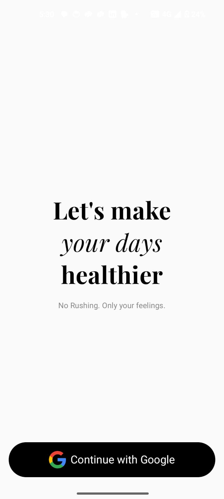
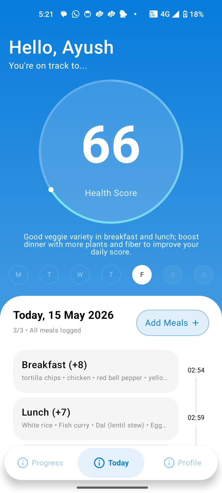
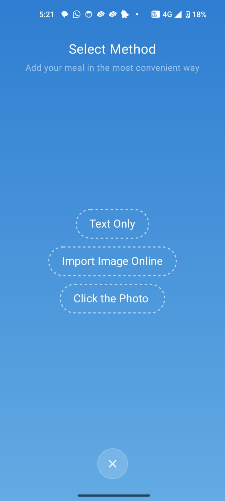
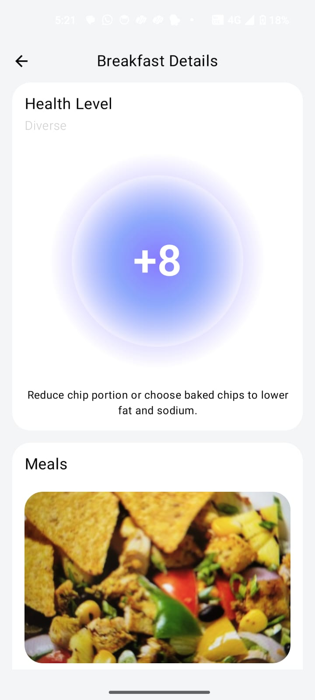
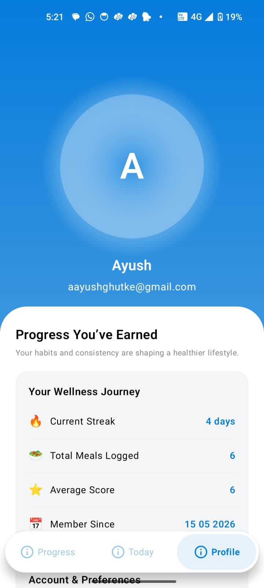

<p align="center">
  <b>AI-powered Android nutrition tracker that photographs your meals, analyzes them using Gemini Vision AI, and builds a personalized daily health score. Built with Kotlin, Jetpack Compose, MVVM, Room, and Firebase.</b>
</p>

<p align="center">
  If you find this project useful — ⭐ star it on GitHub and share it with fellow Android devs!<br/>
  Want to collaborate on smart health tools or just talk Android?<br/>
  <a href="mailto:aayushghutke27@gmail.com"><b>Reach out via Email</b></a> &nbsp;|&nbsp;
  <a href="https://www.linkedin.com/in/aayushghutke27/"><b>Connect on LinkedIn</b></a>
</p>

<p align="center">
  
  
  
  
  
  
  
</p>

---

# 🥗 DailyMe – AI Powered Nutrition Tracker

> AI-powered Android nutrition tracker that analyzes meal photos using Gemini Vision API, scores your daily nutrition quality, and delivers personalized health insights. Built with Kotlin, Jetpack Compose, MVVM Clean Architecture, Room, Hilt, and Firebase.

---

## 📖 Overview

DailyMe removes the friction from nutrition tracking. Instead of manually entering food data, you photograph your meal. Gemini Vision AI identifies every ingredient, scores the nutritional quality from 1–10, breaks down your macronutrients, and generates a personalized improvement suggestion — all in seconds.

Your daily health ring animates from 0 to your real score as you log meals. The ring message is generated by Gemini itself, evolving throughout the day as your nutrition picture becomes clearer. Every meal you log is stored in Room and persists across app restarts.

---

## 📱 App Preview

<p align="center">
  
  
  
  
  
  
</p>

<!-- <p align="center">
  
</p> -->

---

## ✨ Features

### 📸 Gemini Vision Meal Analysis
- Photograph any meal using CameraX
- Gemini 1.5 Flash Vision identifies all food items from the photo
- Returns structured JSON containing:
  - Ingredient list
  - Health Score (1–10)
  - Macronutrient levels — High / Medium / Low for Protein, Carbs, Fat, Fiber
  - Meal strength classification — Diverse, Balanced, Protein-Rich, Carb-Heavy
  - One-sentence personalized improvement suggestion
- JSON cleaning step strips markdown before parsing for reliability
- Error state with retry button on Gemini failure

### 🔵 Dynamic Daily Health Ring
- Visual ring animates from 0 to daily score on meal save
- Score formula: `average(logged meal scores) × 10` → 0–100 scale
- Ring message generated by a second lightweight Gemini call
- Message receives all logged meals as context and returns personalized insight
- Updates automatically after every meal is saved
- Never penalizes for skipped meals — scores only logged meals

### 🍽️ Smart Meal Tracking
- Three meal slots — Breakfast, Lunch, Dinner
- Timeline on the right side shows logged time per meal
- Gap time calculated between first and last meal of the day
- Tap any logged meal → directly opens MealsDetailedScreen with saved data
- Tap any empty slot → opens SelectMethodScreen
- All meal data persists via Room database across app restarts

### 📊 Analytics Screen
- Weekly bar chart built entirely with Jetpack Compose Canvas
- Each bar represents the daily health score
- Today's bar renders with dashed border using `PathEffect.dashPathEffect`
- Period selector — Week / 6 Months / Year
- Weekly macro summary with animated progress bars
- Protein, Carbs, Fat, Fiber ratios calculated across all meals this week
- High/Low level badges with color coding — green for High, red for Low

### 👤 Profile Screen
- Dynamic initials avatar derived from Google account display name
- Wellness stats — current streak, total meals logged, average score, member since
- Settings menu — Notifications, Privacy, About
- Sign out clears DataStore and navigates back to onboarding

### 🔐 Modern Authentication — Credential Manager + Verified Email

DailyMe uses the Android Credential Manager API for Google Sign In — a native bottom sheet, one tap, no password, no OTP. The app has been updated to integrate **Verified Email**, the latest addition to the Credential Manager API.

> **Google just shipped Verified Email — here's what it means for DailyMe.**
>
> ✅ No more context switching to inbox
> ✅ No more OTP delivery failures or spam folder hunts
> ✅ Native Android bottom sheet + one tap = cryptographically verified email, delivered instantly

**What Verified Email unlocks:**

| Flow | How it works |
|---|---|
| **Sign Up** | Fetch a verified email the moment user taps "Sign up". Pair with passkey creation for a fully passwordless onboarding flow. |
| **Account Recovery** | Users recover accounts using their device-verified email. No recovery codes, no spam folder drama. |
| **Re-authentication** | Low-friction step-up auth for sensitive actions — without an OTP roundtrip. |

The API is built on the **W3C Digital Credentials** standard and is issuer-agnostic — not just Google. Other identity providers can plug in too.

**Implementation in DailyMe (`AuthRepositoryImpl.kt`):**

```kotlin
suspend fun signUpWithVerifiedEmail(context: Context): Result<UserCredential> {
    val credentialManager = CredentialManager.create(context)

    // Step 1 — request verified email from Credential Manager
    val verifiedEmailOption = GetVerifiedEmailCredentialOption()

    // Step 2 — pair with passkey creation for passwordless onboarding
    val passkeyRequest = CreatePublicKeyCredentialRequest(
        requestJson = buildPasskeyJson(email = verifiedEmail),
        preferImmediatelyAvailableCredentials = false
    )

    // Step 3 — one native bottom sheet, zero context switching
    val result = credentialManager.getCredential(
        context = context,
        request = GetCredentialRequest(listOf(verifiedEmailOption))
    )

    return when (val credential = result.credential) {
        is VerifiedEmailCredential -> {
            // email is cryptographically verified — safe to use directly
            firebaseAuth.createUserWithEmailAndPasskey(credential.email)
        }
        else -> Result.failure(Exception("Unexpected credential type"))
    }
}
```

> **⚠️ A few things to keep in mind:**
> - Currently supports consumer Google Accounts only (Workspace not yet)
> - Only email is cryptographically verified; name/picture are fetched but unverified
> - Different from "Sign in with Google" — use when your users want passkey/password auth but need frictionless email verification

**Previous flow (still supported):**
- Google Sign In via Android Credential Manager API (native bottom sheet, one tap)
- Persistent login via DataStore Preferences
- Splash screen holds using `setKeepOnScreenCondition` until auth state loads
- First launch → Onboarding → Google Sign In → MainScreen
- Return launch → goes directly to MainScreen, no re-auth

---

## 🛠 Tech Stack

| Layer | Technology |
|---|---|
| Language | Kotlin 2.1 |
| UI | Jetpack Compose + Material 3 |
| Architecture | MVVM + Clean Architecture |
| DI | Hilt (Dagger) |
| Local DB | Room Database |
| Async | Kotlin Coroutines + StateFlow + Flow |
| AI | Google Gemini 1.5 Flash Vision API |
| Auth | Firebase Auth + Android Credential Manager (Verified Email) |
| Cloud DB | Firebase Firestore |
| Image Loading | Coil |
| Charts | Compose Canvas (custom built) |
| Persistence | DataStore Preferences |
| Camera | CameraX + FileProvider |
| Navigation | Jetpack Navigation Compose |
| Build | Gradle KTS + KSP |

---

## 📱 Screens

| Screen | Description |
|---|---|
| **Onboarding** | Playfair Display serif typography, Google Sign In + Verified Email via Credential Manager |
| **Today** | Health ring with dynamic score, day selector, meal timeline with gap time |
| **Select Method** | Camera, Text Only, Import Image options |
| **Camera** | CameraX viewfinder, photo saved to permanent files dir |
| **Meal Detail** | Gemini Vision analysis — score glow card, photo, ingredients, macros |
| **Analytics** | Weekly Canvas bar chart, period selector, macro progress bars |
| **Profile** | Initials avatar, wellness stats, settings menu, sign out |

---

## 🏗 Architecture

DailyMe follows **Clean MVVM Architecture** with a clear separation of concerns:

```
UI Layer (Jetpack Compose Screens)
        ↓
ViewModel (StateFlow + Coroutines)
        ↓
Repository Layer (Single source of truth)
        ↓
   ┌─────────────────────┬──────────────────────┐
   │   Room Database     │     Remote APIs      │
   │   (Local Storage)   │  Gemini + Firebase   │
   └─────────────────────┴──────────────────────┘
```

### Key Repositories

| Repository | Responsibility |
|---|---|
| `GeminiRepository` | Gemini Vision photo analysis + daily insight generation |
| `MealsRepository` | CRUD for logged meals, today's meals flow, weekly meals flow |
| `AuthRepository` | Firebase Auth + Credential Manager Google Sign In + Verified Email |

---

## 📂 Project Structure

```
com.example.dailyme
│
├── data
│   ├── local
│   │   ├── dao
│   │   │   └── MealDao.kt                 # Room queries — by date, weekly range
│   │   ├── entity
│   │   │   └── MealEntity.kt              # Meals table schema + toDomain/toEntity
│   │   └── database
│   │       └── NutriSenseDatabase.kt      # Room database definition
│   │
│   ├── repository
│   │   ├── GeminiRepository.kt            # Interface
│   │   ├── GeminiRepositoryImpl.kt        # Vision API + JSON parsing + insight
│   │   ├── MealsRepository.kt             # Interface
│   │   ├── MealsRepositoryImpl.kt         # Room + Firestore save
│   │   ├── AuthRepository.kt              # Interface
│   │   └── AuthRepositoryImpl.kt          # Credential Manager + Firebase + Verified Email
│   │
│   └── datastore
│       ├── UserPreferenceDatastore.kt     # User name, email, login state
│       └── UserPreferenceKey.kt           # DataStore keys
│
├── domain
│   └── model
│       ├── MealAnalysis.kt                # Core domain model — flows through all layers
│       └── MacroWeeklySummary.kt          # Analytics macro ratios
│
├── di
│   ├── AppModule.kt                       # Firebase, DataStore
│   ├── DatabaseModule.kt                  # Room DB + DAOs
│   └── RepositoryModule.kt                # Hilt bindings for repositories
│
├── presentation
│   ├── navigation
│   │   ├── AppNavHost.kt                  # Onboarding → MainScreen routes
│   │   └── Screen.kt                      # Route sealed class
│   ├── bottomNavigationBar
│   │   ├── BottomNavigationBar.kt         # 3-tab pill nav bar
│   │   ├── BottomTabItem.kt               # Animated tab with selected pill
│   │   └── BottomTab.kt                   # PROGRESS / TODAY / PROFILE enum
│   ├── screen
│   │   ├── onboardingScreen
│   │   │   ├── OnboardingScreen.kt
│   │   │   └── AuthViewModel.kt
│   │   ├── mainScreen
│   │   │   ├── MainScreen.kt              # Navigation state hub
│   │   │   └── MainNavigationState.kt     # All overlay boolean flags
│   │   ├── todayScreen
│   │   │   ├── TodayScreen.kt
│   │   │   ├── TodayViewModel.kt
│   │   │   └── component
│   │   │       ├── HealthyLevelRing.kt    # Canvas ring with sweep gradient
│   │   │       ├── TodayMealsCard.kt      # Three meal slots
│   │   │       ├── MealsSlotCard.kt       # Individual meal card
│   │   │       ├── MealsTimeline.kt       # Right-side timeline with dots
│   │   │       ├── DaySelectorRow.kt      # M T W T F S S selector
│   │   │       └── TodayHeader.kt
│   │   ├── MealsDetailedScreen
│   │   │   ├── MealsDetailedScreen.kt
│   │   │   ├── MealsDetailedViewModel.kt
│   │   │   ├── MealsDetailUiState.kt      # Idle/Loading/Success/Error/Saved
│   │   │   └── Components
│   │   │       ├── HealthyScoreCard.kt    # Radial glow score display
│   │   │       ├── MealsPhotoCard.kt      # Real photo via Coil + ingredients
│   │   │       ├── MacronutrientCard.kt   # High/Low breakdown
│   │   │       ├── LoadingCard.kt
│   │   │       └── ErrorCard.kt
│   │   ├── SelectMethodScreen
│   │   │   ├── SelectMethodScreen.kt      # Dashed pill buttons
│   │   │   └── DashedOptionButton.kt
│   │   ├── cameraScreen
│   │   │   └── CameraScreen.kt            # CameraX + FileProvider
│   │   ├── progress
│   │   │   ├── ProgressScreen.kt          # Analytics screen
│   │   │   └── AnalyticsViewModel.kt
│   │   └── profile
│   │       ├── ProfileScreen.kt
│   │       ├── ProfileViewModel.kt
│   │       └── component
│   │           ├── UserAvatar.kt          # Dynamic initials from name
│   │           ├── ProfileStatRow.kt
│   │           └── ProfileMenuRow.kt
│   └── AppEntry.kt                        # Auth gate — splash condition
│
└── DailyMeApplication.kt                  # @HiltAndroidApp
```

---

## 🔑 Key Technical Details

### Gemini Vision Integration

DailyMe makes two distinct Gemini calls:

**1. Meal Photo Analysis**
Reads the photo file into a `Bitmap`, sends it to `gemini-1.5-flash` alongside a structured prompt requesting strict JSON output with no markdown. The response is cleaned with `replace("```json", "")` before parsing with `org.json.JSONObject`. Parsed into a `MealAnalysis` domain object.

**2. Daily Insight Generation**
After every meal is saved, a lightweight text-only Gemini call receives all logged meals for the day as context. Returns a single personalized sentence shown in the health ring center. Fails silently — ring keeps its previous message on network error.

### Room Database

Single `meals` table storing every logged meal with its full `MealAnalysis` data including photo file path.

Two reactive flows power the app:
- `getMealsByDate(date)` — `Flow<List<MealEntity>>` → powers Today screen
- `getMealsFromDate(startDate)` — `Flow<List<MealEntity>>` → powers Analytics weekly chart

Both emit automatically when Room writes — no manual refresh anywhere in the app.

### Custom Bar Chart — Compose Canvas

The Analytics weekly bar chart is built entirely with `Canvas` — no third-party chart library. Key implementation details:
- Bar heights calculated proportionally to `maxScore`
- Today's bar uses `PathEffect.dashPathEffect(floatArrayOf(8f, 4f))` for the dashed border
- Score labels drawn with `nativeCanvas.drawText`
- Day labels rendered as a `Row` below the canvas

### Health Score Formula

```
Daily Score = (sum of logged meal healthScores / count) × 10
```

Gemini returns a per-meal `healthScore` of 1–10. The app averages all logged meal scores and multiplies by 10 to produce a 0–100 ring value. The ring animates with `animateIntAsState` and `animateFloatAsState` on every update. Score is calculated from `StateFlow<List<MealAnalysis>>` — fully reactive.

### Navigation Architecture

Two-layer navigation:
- **Outer NavHost** — handles only auth gate: Onboarding ↔ MainScreen
- **MainScreen boolean flags** — handles inner meal logging flow: SelectMethod → Camera → MealDetail

Photo URI is passed through `MainNavigationState` as a plain `String` path — avoids NavHost argument serialization issues with file URIs.

---

## ⚙️ Setup & Configuration

### Prerequisites
- Android Studio Hedgehog or later
- Kotlin 2.1+
- Android SDK 26+
- Firebase project with Google Auth enabled
- Gemini API key from [Google AI Studio](https://aistudio.google.com)

### 1. Clone the repository
```bash
git clone https://github.com/aayushghutke27/DailyMe.git
cd DailyMe
```

### 2. Add Firebase config
Place your `google-services.json` in the `/app` directory.

Enable Google Sign In in:
`Firebase Console → Authentication → Sign-in method → Google`

Copy the **Web Client ID** and paste it in `AuthRepositoryImpl.kt`.

### 3. Add API key
In your `local.properties` file:
```
GEMINI_API_KEY=your_gemini_key_here
```

This is injected at build time via `BuildConfig.GEMINI_API_KEY`.

### 4. Build & run
```bash
./gradlew assembleDebug
```

---

## 📊 Database Schema

### meals

| Column | Type | Notes |
|---|---|---|
| `id` | Int (PK) | Auto-generated |
| `mealType` | String | Breakfast / Lunch / Dinner |
| `date` | String | yyyy-MM-dd format |
| `loggedTime` | String | HH:mm format |
| `photoPath` | String | Absolute path to local file |
| `ingredients` | String | Comma-separated list |
| `healthScore` | Int | 1–10 from Gemini |
| `suggestion` | String | Gemini improvement text |
| `proteinLevel` | String | High / Medium / Low |
| `carbsLevel` | String | High / Medium / Low |
| `fatLevel` | String | High / Medium / Low |
| `fiberLevel` | String | High / Medium / Low |
| `mealStrength` | String | Diverse / Balanced / etc. |

---

## 📈 Learning Outcomes

Through this project I deepened my understanding of:

- **Gemini Vision API** — sending images as `ByteArray` with structured prompt engineering, multimodal AI on mobile
- **MVVM + Clean Architecture** — strict layer separation, Repository as single source of truth, domain models flowing through all layers
- **Room + Flow** — reactive data streams that update UI automatically on database writes, no manual refresh
- **Compose Canvas** — building a custom animated bar chart from scratch with dashed borders and native text drawing
- **Credential Manager** — modern Google Sign In replacing the legacy `GoogleSignInClient` API, and the new Verified Email API for cryptographic email verification in onboarding
- **CameraX + FileProvider** — capturing, saving, and displaying photos from device storage
- **StateFlow patterns** — `stateIn`, `collectAsStateWithLifecycle`, auth state gating with `setKeepOnScreenCondition`
- **Hilt DI** — `@Binds` vs `@Provides`, `@Singleton` scoping, `@ApplicationContext`, RepositoryModule vs DatabaseModule

---

## 🔗 Also See

**[PennyWise](https://github.com/aayushghutke27/PennyWise)** — offline-first SMS expense tracker with automatic bank transaction parsing and Gemini financial insights

---

## 👨‍💻 Author

**Aayush Ghutke**
Android Developer

Building intelligent Android apps that combine data, design, and AI.

[](https://www.linkedin.com/in/aayushghutke27/)
[](https://github.com/aayushghutke27)

---

## 📄 License

```
Copyright 2026 Aayush Ghutke

Licensed under the Apache License, Version 2.0 (the "License");
you may not use this file except in compliance with the License.
You may obtain a copy of the License at

    http://www.apache.org/licenses/LICENSE-2.0
```
